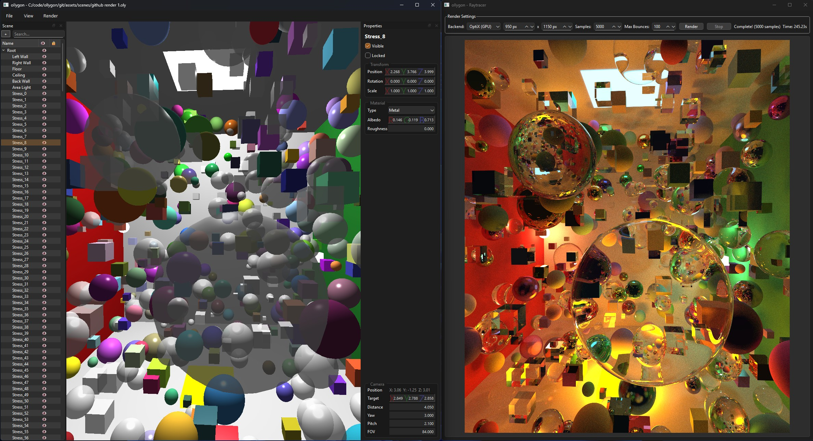

# ollygon

#### 3d Editor and Raytracer in C++/Qt
- Viewport: OpenGL
- CPU Raytracing - Multi-threaded & deterministic
- GPU Raytracing - CUDA/OptiX

### Goals:
Personal project with the aim of learning more about:
- C++ application building with Qt
- Geometry
- Light Transport

### Building:
Requires:
- CMake 3.16
- Qt 6.9.x
- C++ 20 compiler
- For GPU Raytracing, CUDA/Optix.  I'm using CUDA ver 13.0, OptiX SDK 9.0.0.  OptiX back to 7.x _may_ be supported, but 8.0+ is recommended.  CMake can be updated for other CUDA versions

#### Windows (VS2022)
run the build .bat scripts
#### Linux
I haven't tested on Linux yet.  It presumably should work fine if cmake is called with gcc instead of msvc, then `make -j8`

### Licence
[MIT Licence](LICENSE)

---
###### _(pronounced ollyjon)_
